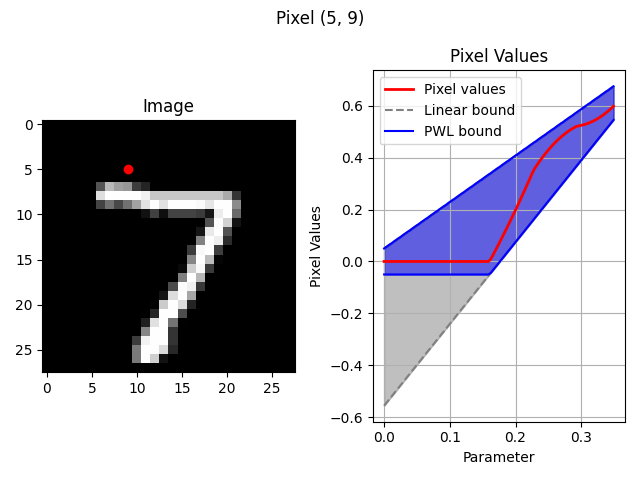

# Geometric Verification PWL

## Introduction:

This repo contains code for reproducing the piecewise linear (PWL) bounds introduced in [1].


## Installation To install this project, follow these steps:

1. Clone the repository:

   ```bash git clone https://github.com/benbatten/PWL-Geometric-Verification.git```

2. Navigate to the project directory:

   ```cd PWL-Geometric-Verification```

3. Install dependencies :

   ```pipenv install -r requirements.txt```


   ## Usage

   Here's how to use the code to compute PWL bounds for a rotation on an MNIST sample of 5 degrees:

   ```python main.py --transformation rotate --LB 0 --UB 5 --image_number 1 --save_bounds --bound_type pw_linear --dset MNIST```



## References:

[1] Batten, B., Zheng, Y., De Palma, A., Kouvaros, P., & Lomuscio, A. (2024). Verification of Geometric Robustness of Neural Networks via Piecewise Linear Approximation and Lipschitz Optimisation. _European Conference on Artificial Intelligence_.